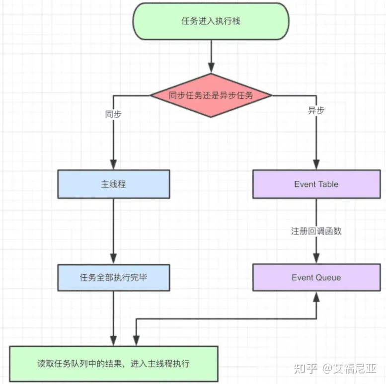
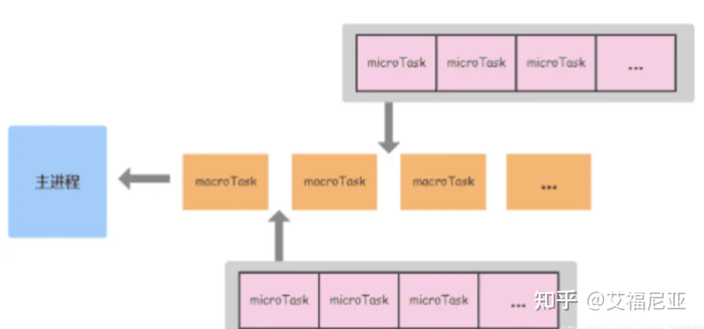

# EventLoop

## 知识铺垫

javascript代码运行时，任务被分为两种，宏任务（MacroTask/Task）和微任务（MircoTask）；Event Loop在执行和协调各种任务时也将任务队列分为Task Queue和MircoTak Queue分别对应管理宏任务（MacroTask/Task）和微任务（MircoTask）；作为队列，Task Queue和MircoTak Queue也具备队列特性：先进先出（FIFO—first in first out）。

## 宏任务（MacroTask）

基本上，我们将javascript中非微任务（MircoTask）的所有任务都归为宏任务，比如：

- script中全部代码
- DOM操作
- 用户交互操作
- 所有的网路请求
- 定时器相关的 setTimeout、setInterval、setImmediate、requestAnimationFrame 等

## 微任务（MircoTask）

在 HTML 标准中，并没有明确规定 Microtask，但是实际开发中包含以下四种：

- Promise中的then、catch、finally（原理参考：【js进阶】手撕Promise，一码一解析 包懂）
- MutationObserver（监视 DOM 变动的API，详情参考MDN）
- Object.observe(废弃：监听标准对象的变化)
- Process.nextTick（Node环境，通常也被认为是微任务）

## javascript runtime

javascript runtime：为 JavaScript 提供一些对象或机制，使它能够与外界交互，是javascript的执行环境。javascript执行时会创建一个main thread主线程和call-stack 调用栈(执行栈，遵循后进先出的规则)，所有的任务都会被放到调用栈/执行栈等待主线程执行。其运行机制如下：

- 1）主线程自上而下依次执行所有代码；
- 2）同步任务直接进入到主线程被执行；
- 3）异步任务进入到Event Table，当异步任务有结果后，将相对应的回调函数进行注册，放入Event Queue；
- 4）主线程任务执行完空闲下来后，从Event Queue（FIFO）中读取任务，放入主线程执行；
- 5）放入主线程的Event Queue任务继续从第一步开始，如此循环执行；
上述步骤执行过程就是我们所说的事件循环(Event Loop)，上图展示了事件循环中的一个完整循环过程。

## 浏览器环境的Event Loop

不同的执行环境中，Event Loop的执行机制是不同的；例如Chrome 和 Node.js 都使用了 V8 Engine：V8 实现并提供了 ECMAScript 标准中的所有数据类型、操作符、对象和方法（注意并没有 DOM）。但它们的 Runtime 并不一样：Chrome 提供了 window、DOM，而 Node.js 则是 require、process 等等。我们在了解浏览器中Event Loop的具体表现前需要先整理同步、异步、微任务、宏任务之间的关系！

### 1.同步、异步 和 宏任务、微任务

宏任务和微任务是相对而言的，根据代码执时循环的先后，将代码执行分层理解，在每一层（一次）的事件循环中，首先整体代码块看作一个宏任务，宏任务中的 Promise（then、catch、finally）、MutationObserver、Process.nextTick就是该宏任务层的微任务；宏任务中的同步代码进入主线程中立即执行的，宏任务中的非微任务异步执行代码将作为下一次循环的宏任务时进入调用栈等待执行的；此时，调用栈中等待执行的队列分为两种，优先级较高先执行的本层循环微任务队列（MicroTask Queue），和优先级低的下层循环执行的宏任务队列（MacroTask Queue）！ 

注意：每一次/层循环，都是首先从宏任务开始，微任务结束;

