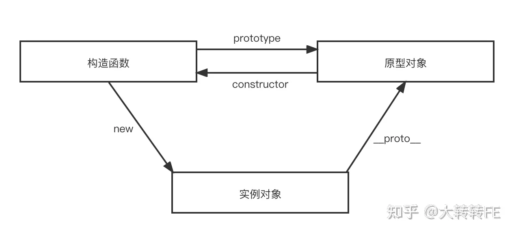
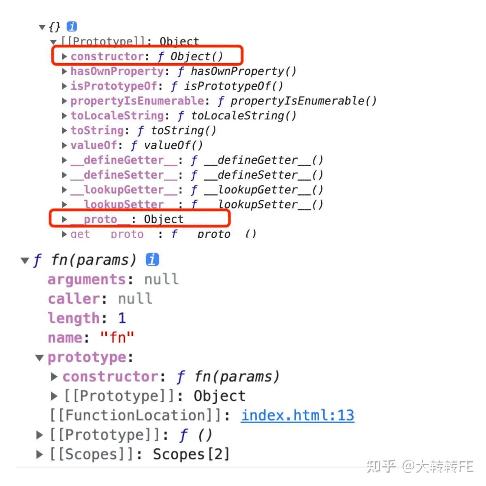
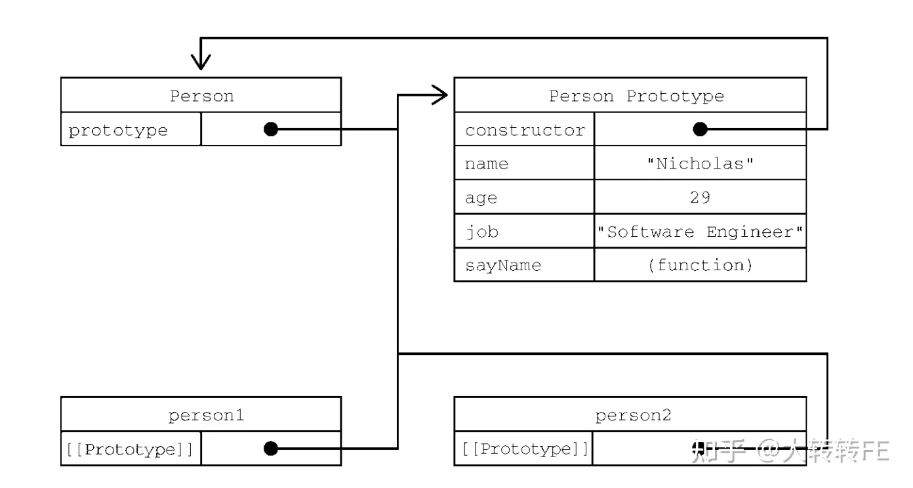
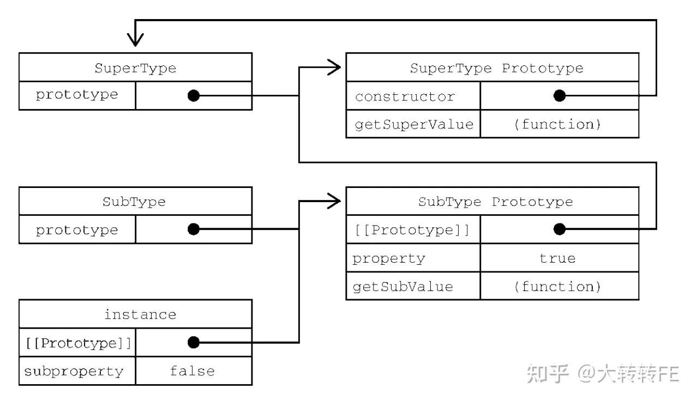

# 原型链

「实例与原型对象之间有直接的联系，但实例与构造函数之间没有。」  

js分为「函数对象」和「普通对象」，每个对象都有__proto__属性，但是只有函数对象且「非箭头函数」才有prototype属性。

属性__proto__是一个对象【实例通过__proto__隐式原型指向其原型对象】，它有两个属性，constructor和__proto__；
原型对象有一个默认的constructor属性，用于记录实例是由哪个构造函数创建；


## 原型

创建一个函数(非箭头函数)，就会按照特定的规则为这个函数创建一个 prototype 属性（指向原型对象）。默认情况下，所有原型对象自动获得一个名为 constructor 的属性，指回与之关联的构造函数。在自定义构造函数时，原型对象默认只会获得 constructor 属性，其他的所有方法都继承自Object。每次调用构造函数创建一个新实例，这个实例的内部[[Prototype]]指针就会被赋值为构造函数的原型对象。脚本中没有访问这个[[Prototype]]特性的标准方式，但 Firefox、Safari 和 Chrome会在每个对象上暴露__proto__属性，通过这个属性可以访问对象的原型。

``` javascript
function Person() {}
// 说明：name,age,job这些本不应该放在原型上，只是为了说明属性查找机制
Person.prototype.name = "Nicholas"; 
Person.prototype.age = 29; 
Person.prototype.job = "Software Engineer"; 
Person.prototype.sayName = function() { 
 console.log(this.name); 
};
let person1 = new Person()
let person2 = new Person()
​
// 声明之后，构造函数就有了一个与之关联的原型对象
console.log(Object.prototype.toString.call(Person.prototype)) // [object Object]
console.log(Person.prototype) // {constructor: ƒ}
​
// 构造函数有一个 prototype 属性引用其原型对象，而这个原型对象也有一个constructor 属性，引用这个构造函数
// 换句话说，两者循环引用
console.log(Person.prototype.constructor === Person); // true
​
// 构造函数、原型对象和实例是 3 个完全不同的对象
console.log(person1 !== Person); // true 
console.log(person1 !== Person.prototype); // true 
console.log(Person.prototype !== Person); // true
​
// 实例通过__proto__链接到原型对象，它实际上指向隐藏特性[[Prototype]] 
// 构造函数通过 prototype 属性链接到原型对象，实例与构造函数没有直接联系，与原型对象有直接联系，后面将会画图再次说明这个问题
console.log(person1.__proto__ === Person.prototype); // true 
conosle.log(person1.__proto__.constructor === Person); // true
​
// 同一个构造函数创建的两个实例，共享同一个原型对象 
console.log(person1.__proto__ === person2.__proto__); // true
​
// Object.getPrototypeOf()，返回参数的内部特性[[Prototype]]的值 ，用于获取原型对象，兼容性更好
console.log(Object.getPrototypeOf(person1) == Person.prototype); // true
```

如下图：


Person.prototype 指向原型对象，而 Person.prototype.contructor 指回 Person 构造函数。原型对象包含 constructor 属性和其他后来添加的属性。Person 的两个实例 person1 和 person2 都只有一个内部属性指回 Person.prototype，而且两者都与构造函数没有直接联系。

## 原型层级

在通过对象访问属性时，会按照这个属性的名称开始搜索。搜索开始于对象实例本身。如果在这个实例上发现了给定的名称，则返回该名称对应的值。如果没有找到这个属性，则搜索会沿着指针进入原型对象，然后在原型对象上找到属性后，再返回对应的值。因此，在调用 person1.sayName()时，会发生两步搜索。首先，JavaScript 引擎会问：“person1 实例有 sayName 属性吗？”答案是没有。然后，继续搜索并问：“person1 的原型有 sayName 属性吗？”答案是有。于是就返回了保存在原型上的这个函数。在调用 person2.sayName()时，会发生同样的搜索过程，而且也会返回相同的结果。这就是原型用于在多个对象实例间共享属性和方法的原理。

## 原型链
构造函数、原型和实例的关系：每个构造函数都有一个prototype指向原型对象，原型对象有一个constructor属性指回构造函数，而实例有一个内部指针指向原型。如果原型是另一个类型的实例呢？那就意味着这个原型本身有一个内部指针指向另一个原型，相应地另一个原型也有一个指针指向另一个构造函数。这样就在实例和原型之间构造了一条原型链。这就是原型链的基本构想。

``` javascript
function SuperType() {
  this.property = true;
}
SuperType.prototype.getSuperValue = function () {
  return this.property;
};
function SubType() {
  this.subproperty = false;
}
// 继承 SuperType 
SubType.prototype = new SuperType();
SubType.prototype.getSubValue = function () {
  return this.subproperty;
};
let instance = new SubType();
console.log(instance.getSuperValue()); // true
```

SuperType 和 SubType这两个类型分别定义了一个属性和一个方法。这两个类型的主要区别是 SubType 通过创建 SuperType 的实例并将其赋值给自己的原型 SubTtype. prototype 实现了对 SuperType 的继承。这个赋值重写了 SubType 最初的原型，将其替换为SuperType 的实例。这意味着 SuperType 实例可以访问的所有属性和方法也会存在于 SubType. prototype。这样实现继承之后，代码紧接着又给 SubType.prototype，也就是这个 SuperType 的实例添加了一个新方法。最后又创建了 SubType 的实例并调用了它继承的 getSuperValue()方法。



## 模拟new

使用new时，到底发生了什么？

1.创建一个空对象，作为将要返回的对象实例  
2.将这个空对象的原型，指向了构造函数的prototype属性  
3.将这个空对象赋值给函数内部的this关键字  
4.开始执行构造函数内部的代码  
5.如果构造函数返回一个对象，那么就直接返回该对象，否则返回创建的对象  

也就是说，构造函数内部，this指的是一个新生成的空对象，所有针对this的操作，都会发生在这个空对象上。构造函数之所以叫“构造函数”，就是说这个函数的目的，就是操作一个空对象（即this对象），将其“构造”为需要的样子。

``` javascript
function simulateNew() {
  let newObject = null,result = null,
    constructor = Array.prototype.shift.call(arguments)
  // 参数判断
  if (typeof constructor !== 'function') {
    console.error('type error')
    return
  }
  // 新建一个空对象，对象的原型为构造函数的 prototype 对象
  newObject = Object.create(constructor.prototype)
  // 将 this 指向新建对象，并执行函数
  result = constructor.apply(newObject, arguments)
  // 判断返回对象
  const flag =
    result && (typeof result === 'object' || typeof result === 'function')
  // 判断返回结果
  return flag ? result : newObject
}
​
/**  测试如下  */
function Person(name) {
  this.name = name
}
​
const p1 = new Person("p1")
const p2 = simulateNew(Person, 'p2')
​
console.log("p1",p1, p1 instanceof Person);
console.log('p2', p2, p2 instanceof Person)
```

## 模拟instanceof

instanceof 主要的实现原理就是 **「只要右边变量的」** prototype **「在左边变量的原型链上即可」**。因此，instanceof 在查找的过程中会遍历左边变量的原型链，直到找到右边变量的 prototype，如果查找失败，则会返回 false，告诉我们左边变量并非是右边变量的实例。

``` javascript
function instanceOf(leftVaule, rightVaule) {
  let rightProto = rightVaule.prototype; // 取右表达式的 prototype 值
  leftVaule = leftVaule.__proto__; // 取左表达式的__proto__值
  while (true) {
    if (leftVaule === null) {
      return false;
    }
    if (leftVaule === rightProto) {
      return true;
    }
    leftVaule = leftVaule.__proto__
  }
}
```

## 总结
- 访问对象的一个属性，先在自身查找，如果没有，会访问对象的__proto__，沿着原型链查找，一直找到Object.prototype.__proto__。
- 每个函数都有prototype属性，会指向函数的原型对象。
- 所有函数的原型对象的__proto__，会指向Object.prototype。
- 原型链的尽头是Object.prototype.__proto__，为null。