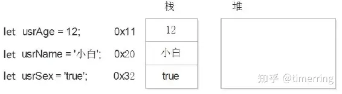
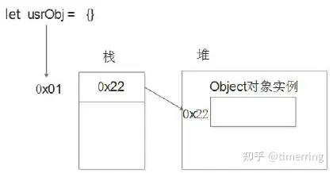
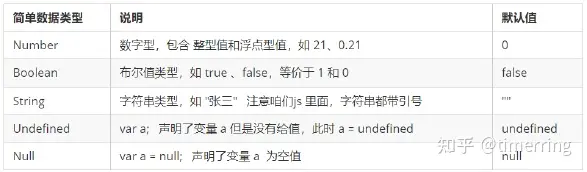
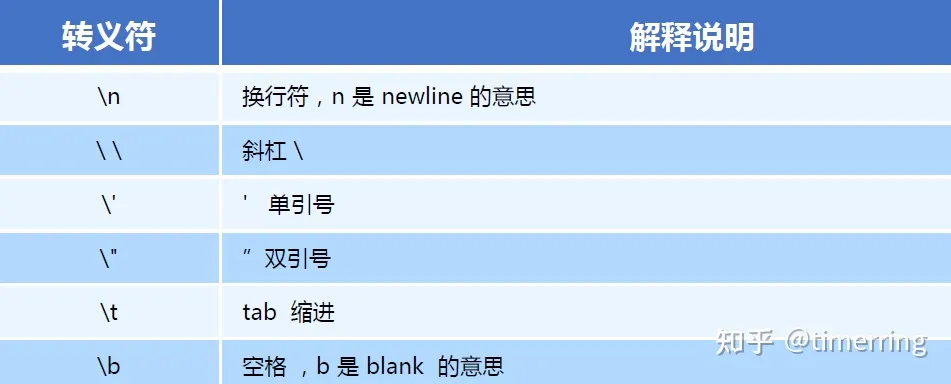
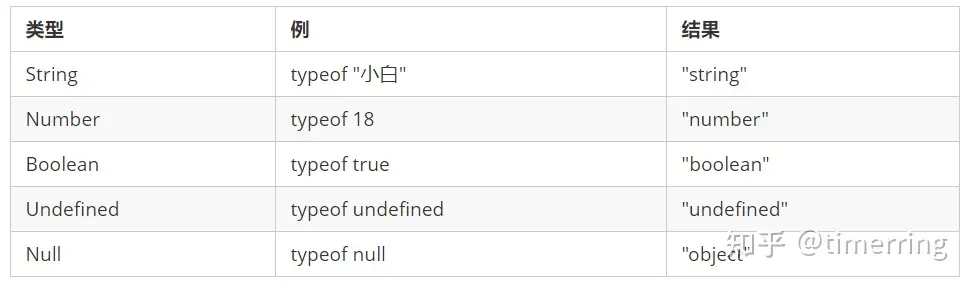
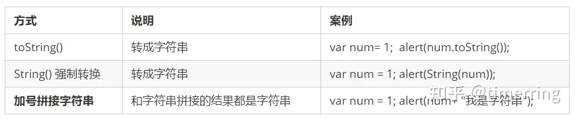
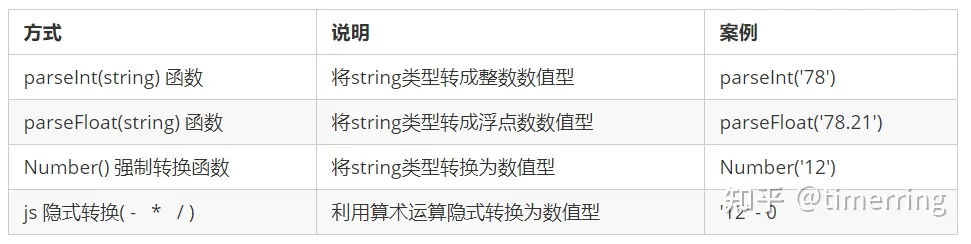
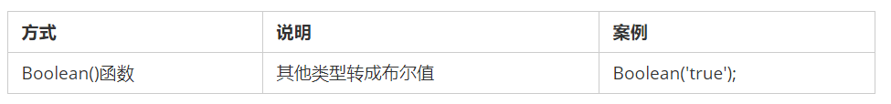

# 数据类型

## 数据类型的分类
- 简单数据类型（Number,String,Boolean,Null,Undefined）又叫做**值类型**。在存储时变量中存储的是值本身。
- 复杂数据类型（Object,Array,Function,RegExp,Error）在存储时变量中存储的仅仅是地址（引用），因此叫做**引用数据**类型，通过 new 关键字创建的对象（系统对象、自定义对象），如 Object、Array、Date 等。

堆栈空间分配区别：

- 栈（操作系统）：由操作系统自动分配释放存放函数的参数值、局部变量的值等。其操作方式类似于数据结构中的栈；**简单数据类型存放到栈里面**。


- 堆（操作系统）：存储复杂类型 (对象)，一般由程序员分配释放，若程序员不释放，由垃圾回收机制回收。**引用数据类型存放到堆里面。引用类型变量（栈空间）里存放的是地址，真正的对象实例存放在堆空间中。**


JavaScript 中的简单数据类型及其说明如下：


## Number
JavaScript 数字类型既可以用来保存整数值，也可以保存小数 (浮点数）。

### 数字型进制  
最常见的进制有二进制、八进制、十进制、十六进制。在 JS 中八进制前面加 0，十六进制前面加 0x。
``` javascript
var num = 0xA;
var num2 = 012; // 对应十进制的10
```
#### 数字型范围  
JavaScript 中数值的最大和最小值

最大值：Number.MAX_VALUE，这个值为： 1.7976931348623157 e+308  
最小值：Number.MIN_VALUE，这个值为：5 e-32
### 三个特殊值
Infinity ，代表无穷大，大于任何数值  
-Infinity ，代表无穷小，小于任何数值  
NaN ，Not a number，代表一个非数值  
### IsNaN（）
用来判断一个变量是否为非数字的类型，返回 true 或者 false。  

## String


字符串型可以是引号中的任意文本，其语法为双引号 "" 和单引号 ''  

因为 HTML 标签里面的属性使用的是双引号，**JS 这里我们更推荐使用单引号**。JS 可以用单引号嵌套双引号。

### 字符串转义符


### 字符串长度
通过字符串的 length 属性可以获取整个字符串的长度。
``` javascript
alert(strMsg.length); // show the length of strMsg
```
### 字符串拼接
多个字符串之间可以使用 + 进行拼接，其拼接方式为 字符串 + 任何类型 = 拼接之后的新字符串
``` javascript
console.log('timerring' + age + '岁'); // timerring18岁 (变量是不能添加引号的，因为加引号的变量会变成字符串)
```

## Boolean
布尔类型有两个值：true 和 false ，其中 true 表示真（对），而 false 表示假（错）。布尔型和数字型相加的时候， true 的值为 1 ，false 的值为 0。

## Undefined 和 Null
一个声明后没有被赋值的变量会有一个默认值 undefined ( 如果进行相连或者相加时，注意结果的差别）

``` javascript
var variable;
console.log(variable); // undefined
console.log('你好' + variable); // 你好undefined
console.log(11 + variable); // NaN
console.log(true + variable); // NaN
console.log(NaN +1); //NaN
```
一个声明变量给 null 值，里面存的值为空
``` javascript
var vari = null;
console.log('你好' + vari); // 你好null
console.log(11 + vari); // 11
console.log(true + vari); // 1
```

## 获取变量数据类型
Typeof 可用来获取检测变量的数据类型

``` javascript
var num = 18;
console.log(typeof num) // 结果 number
```


## 数据类型转换
使用表单、prompt **获取过来的数据默认是字符串 String 类型的**，此时就不能直接简单的进行加法运算，而需要转换变量的数据类型。

#### 转换为字符串

通常用第三个比较多，例如 alert(num + '')，加一个空字符串。

#### 转换为数字型

>注意：parseInt 是直接对于浮点数进行整数位取整，舍去浮点数位。 用算数运算 - * / 可以实现隐式转换。


#### +号作为正号解析可以转换成数字型!!!
```javascript
console.log(+'123')  // 转换为数字型123
console.log(typeof +'123')  // number
let score = +prompt('请输入成绩') // +将输入转为数字型
```

#### 转换为布尔型


- 代表空、否定的值会被转换为 false ，如 ''、0、NaN、null、undefined。
- 其余值都会被转换为 true